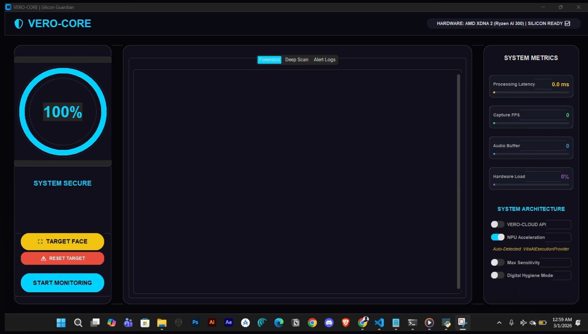

# 🛡️ VERO: Your Silicon-Hardened AI Bodyguard

> **The Problem:** Deepfakes aren't just for viral videos anymore. They are weaponized for fake wire transfers, identity theft on video calls, and compromising biometric security.
> **The Solution:** VERO (Verified Entity Real-time Observer). A local, decentralized shield that catches AI clones at the source.

VERO is a high-performance defense engine that detects AI-generated audio and video in real-time. Built specifically for the **AMD Ryzen AI architecture**, it runs entirely on your device—meaning your face and voice never leave the local silicon.

---

## 🌟 Why VERO?

### � Real-Time Detection
VERO hooks into your system's audio and video streams. Within **600 milliseconds** of a deepfake starting on a call, the "TrustRing" turns red, alerting you to the threat before you can be compromised.

### 🔒 100% Offline & Private
Most AI tools need the "Cloud." VERO doesn't. You can turn off your Wi-Fi, go into **Airplane Mode**, and VERO still works at full capacity. Your biometric privacy is guaranteed by hardware, not just a privacy policy.

### � Surgical Accuracy
Our **Bimodal Fusion Engine** doesn't just look at one thing. It scans for technical microscopic flaws:
- **Audio Spectral Jitter:** Catching the robotic "noise" in AI-cloned voices.
- **Micro-Artifacts:** Detecting the pixel jitter and mouth-sync errors that AI generates.
- **Target Lock:** Manual ROI (Region of Interest) targeting to focus the AI's power on a specific face.

---

## 🛠️ How to Use VERO

### 🖥️ The Desktop Dashboard (GUI)
Run the central monitoring station with the full visual dashboard.



```bash
python run.py
```
*Best for: Protecting Zoom/Teams calls and general personal security.*

### 🔍 Tactical Forensic CLI
Scan any file (Video/Audio/Image) for a deep-dive investigation.
```bash
python cli_analyzer.py --input evidence_video.mp4
```
*Best for: Verifying digital evidence or suspicious media files.*

---

## ⚡ AMD XDNA 2 Powered Performance

By offloading complex AI math to the **AMD XDNA 2 NPU (Neural Processing Unit)**, VERO achieves what standard software can't:

| Metric | Software-Only (CPU) | VERO (NPU Optimized) |
| :--- | :--- | :--- |
| **Detection Speed** | Slow (~200ms lag) | **Instant (<10ms)** |
| **System Impact** | Heavy (80%+ CPU) | **Light (<10% CPU)** |
| **Battery Consumption**| High | **Ultra-Low** |
| **Security State** | Cloud-Dependent | **100% Air-Gapped** |

---

## 📦 Getting Started

1. **Install Dependencies:**
   ```bash
   python install.py
   ```
2. **Download Models:**
   ```bash
   python engine_npu/models/download_models.py
   ```
3. **Engage VERO:**
   ```bash
   python run.py
   ```

---

## �️ Our Philosophy
We believe **Trust is a Hardware Property**. In an age of synthetic identities, VERO returns the power of verification back to the individual.

**Team VERO**  
*Privacy Guaranteed by Silicon.*
